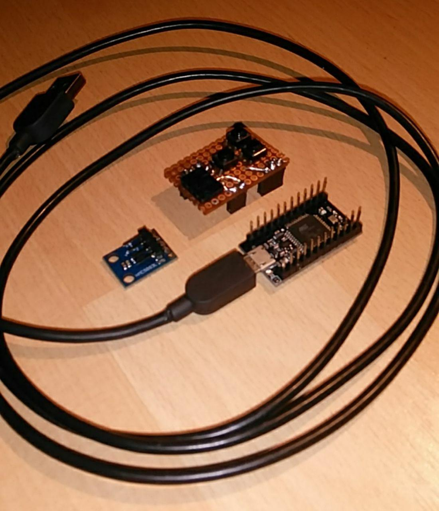

# MagnetoMouse

Use a AT Mega32U4 (Arduino Leonardo Micro) 3 buttons and HMC or QMC5883L magnetometer as USB mouse.

- use earth magnetic field
- independed of the gravitation constant of the universe (?)
- left and right mouse button (press = set PIN 9 or PIN 7 to GND)
- press middle button and change angle up/down makes cursor keyes up/down pressing (press = PIN 8 to GND)

Wiring magnetometer (I2C):

- VCC to VCC
- GND to GND
- SCL to PIN 3
- SDA to PIN 2

